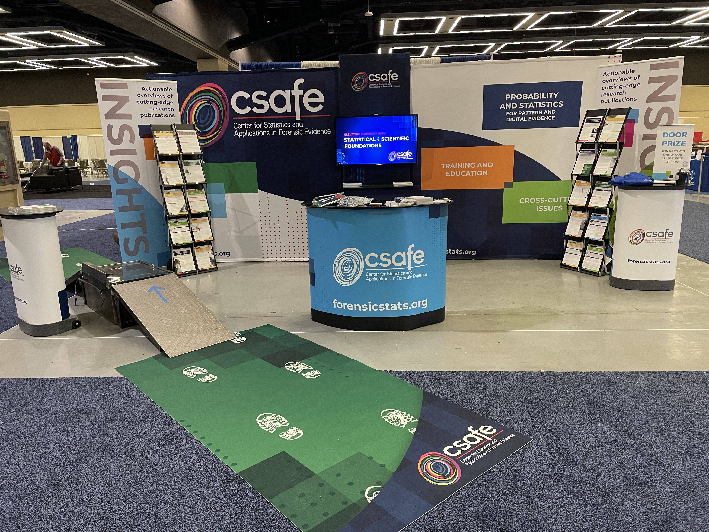
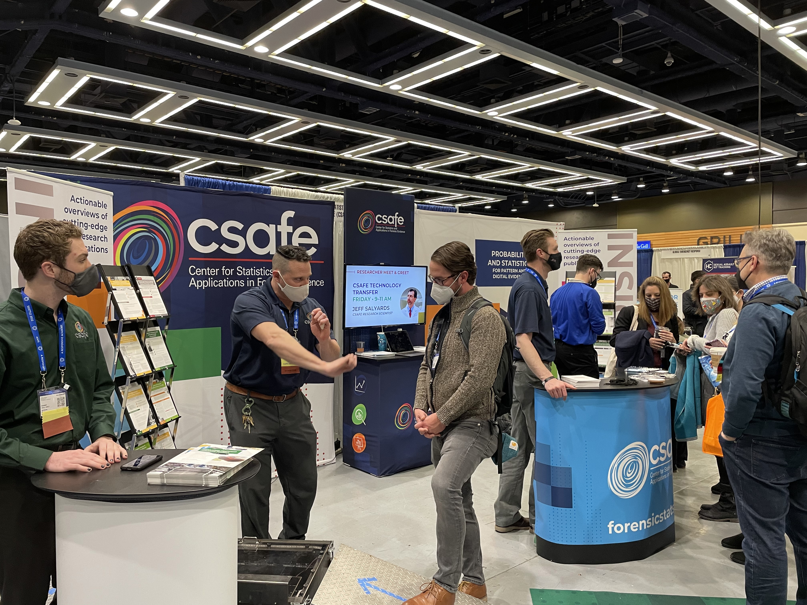
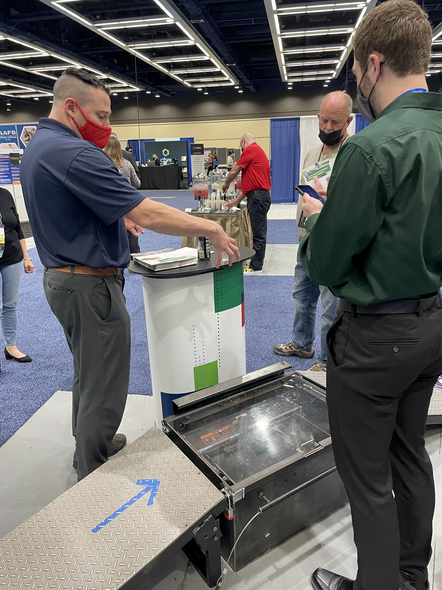
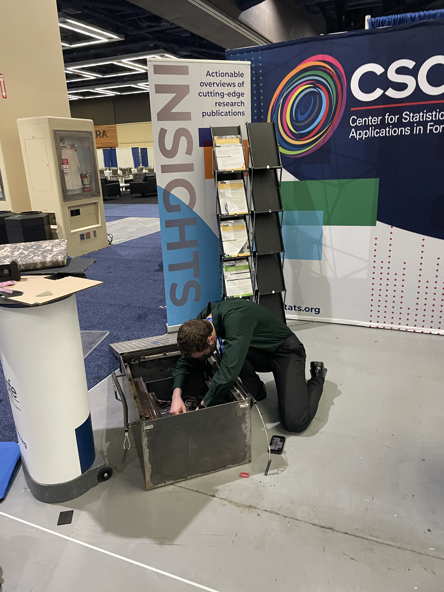
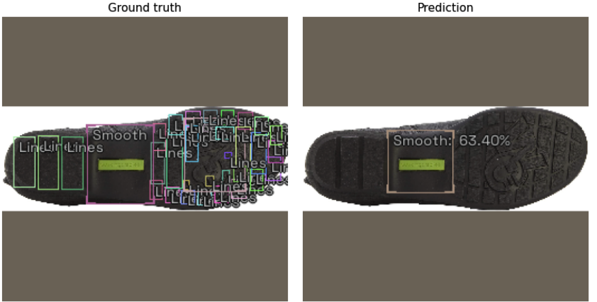

```{r load_refs, echo=FALSE, cache=FALSE, include = F}
library(RefManageR)
BibOptions(check.entries = FALSE,
           bib.style = "numeric",
           cite.style = 'authoryear',
           style = "html",
           hyperlink = FALSE,
           no.print.fields = c("isbn", "urldate"),
           dashed = FALSE)

bb <- ReadBib("./refs.bib", check = T)
```

```{r setup, include = F}
library(tidyverse)
library(magrittr)
library(ggplot2)
library(keras)
library(furrr)
plan(multicore)
mytheme <- theme_bw() +
  theme(panel.grid.major = element_line(color = "grey50"),
        panel.grid.minor = element_line(color = "grey60"),
        plot.background = element_rect(fill = "transparent", color = NA),
        legend.background = element_rect(fill = "white", color = "grey"))

theme_set(mytheme)
knitr::opts_chunk$set(dev.args = list(bg = 'transparent'),
                      echo = FALSE, message = F, warning = F, cache = T,
                      dpi = 300, dev = 'png')


```

class:primary-red
## Scanner @ AAFS

.pull-left[
 
].pull-right[

]

---
class:primary-red
## Scanner @ AAFS


.pull-left[
].pull-right[

]


---
class:primary-red
## Scanner Update

- Building iteration 2 of the scanner:
  - lighter weight
  - vacuum-formed box
  - less variability of mirror angles, camera placement, etc.
  - lower risk of capturing extra information
  
  - "Core" of scanner should work indoors and outdoors
  
- Original generation scanner should be operational again (after AAFS damage) within 2 weeks


---
class:primary-red
## Scanner: Future Work

- Database set up for image downloads

- Reach out to practitioners and collaborators to set up additional data collection sites

    - Contacts from AAFS
    - Scanner at University of Nebraska Lincoln

- Work with IRB to determine whether additional oversight is necessary


---
class:primary-blue
## Statistical Modeling Update

- Texture Detection
    - Model fit using icevision.ai
    - Regions identified automatically and then labeled
    - Model identifies largest area of the shoe and predicts well for that region
    - Very low accuracy on smaller shoe areas
    
- Plan to fit with shapes instead of textures to debug:
    - Is texture too subtle for the network to detect?
    - Is the model just not structured well for the features we're trying to detect?
    - Model structure vs. data quality vs. implementation

- All work performed on images from Zappos website


---
class: primary-blue
## Results



---
class: primary-blue
## Statistical Modeling Future Work

#### Different Features
- Transfer over model with to shoe scanner data

- Train models on shapes, logos, distinct text, etc. 

- Project physical dimensions of shoes that could correspond to shoe size

#### Model Variations

- Data will be fit using different model variations including RetinaNet, YOLO (You Only Look Once), and VarifocalNet

- Utilize the Icevision package to extend the fastai library’s limitations


